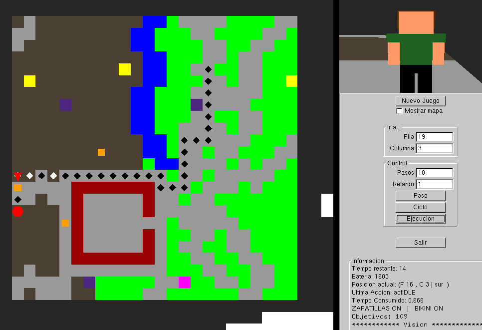
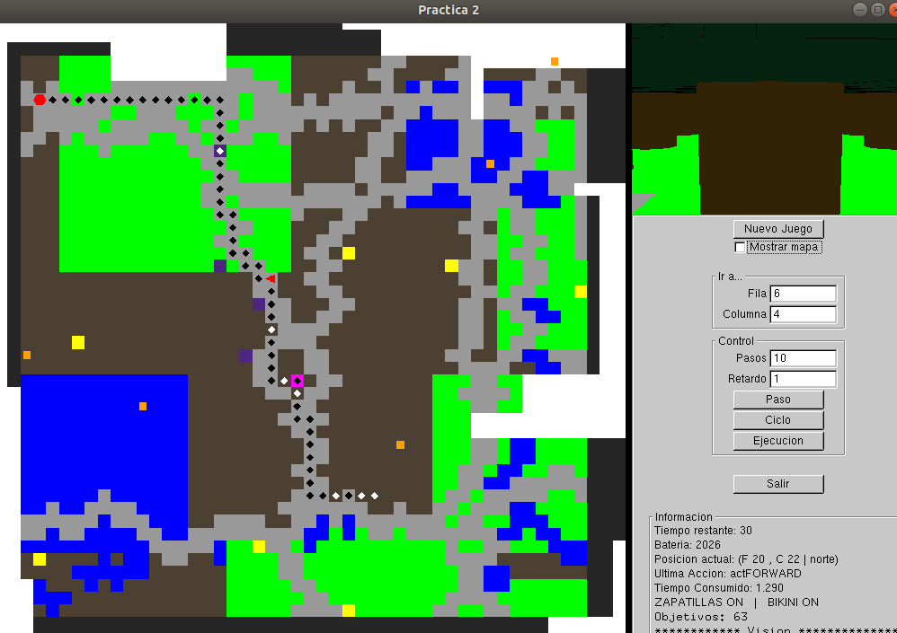
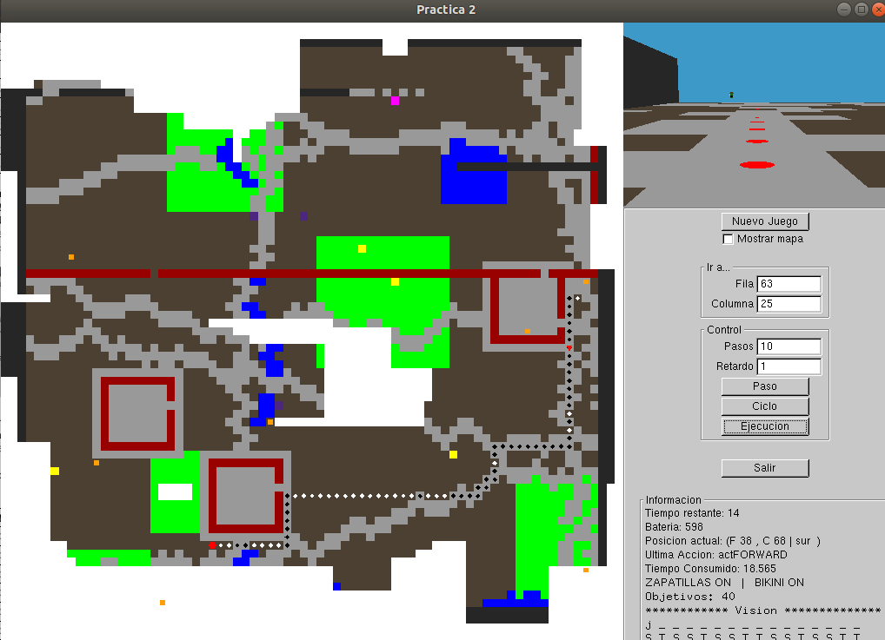
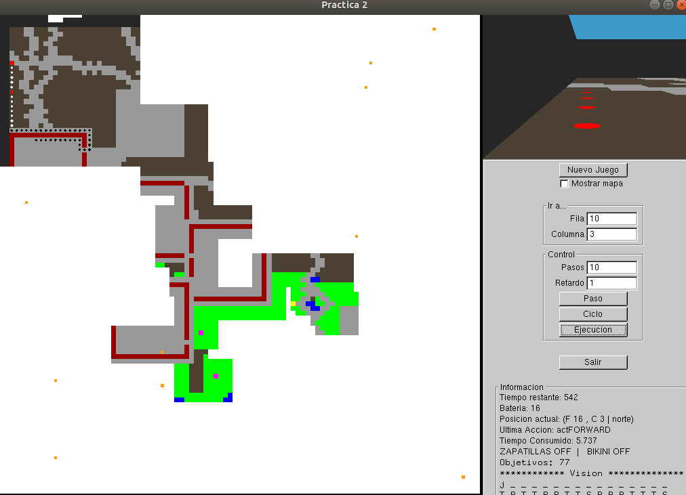
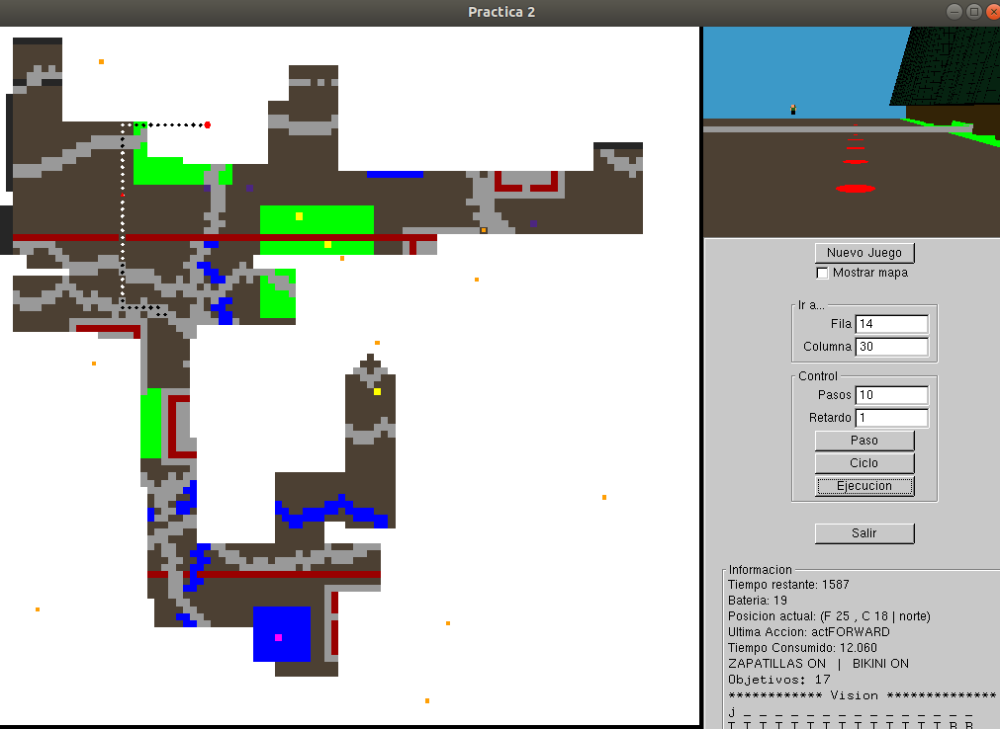
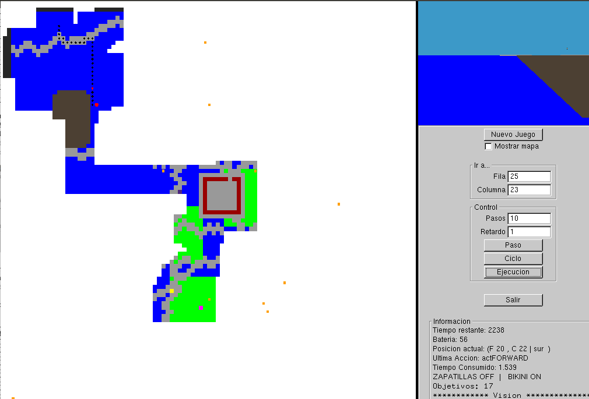

# Nivel 1

En los niveles 1a, 1b y 1c he considerado que nos pueden cambiar el objetivo. Esto es, si calculamos un plan para un objetivo y antes de llegar a él nos cambian dicho objetivo, mi robot es capaz de llegar al primer objetivo y luego ir a por el nuevo objetivo.

# Nivel 1a: Búsqueda en profundidad

Este algoritmo ya está implementado y se basa en una pila (LIFO).

# Nivel 1b: Búsqueda en anchura

En este nivel, me he basado en el algoritmo ya implementado (búsqueda en profundidad). La diferencia entre estos algoritmos es que la búsqueda en profundidad se basa en una pila (LIFO) y la búsqueda en anchura se basa en una cola (FIFO), y así poder recorrer el árbol en anchura.

# Nivel 1c: Búsqueda de costo uniforme
## Algoritmo

En este algoritmo me he basado en los dos anteriores, salvo que en este caso la estructura de datos que he usado es una **cola con prioridad**, que almacena los nodos ordenados según su coste.

## Coste

Para poder ordenar los nodos según su coste, en la declaración de la estructura `nodo` he incluido algunos atributos y métodos para calcular el costo de cada nodo. Dicho costo se calcula a partir de la distancia entre el origen y el destino, multiplicado por el coste del camino ya recorrido. Por lo que en cada iteración, se expande el nodo con menor coste total.

Además, he creado un método (`int costo_casilla(char casilla)`) para obtener el costo de una casilla dada a partir de su terreno. Además, distingo si tiene bikini y/o zapatillas para aplicar la reducción del coste.

# Nivel 2: Agente reactivo/deliberativo

## Algoritmo

En este nivel, para calcular el plan, he reutilizado el algoritmo del nivel 1c (búsqueda con costo uniforme).

## Coste

Sin embargo, como en este nivel no conocíamos las casillas no exploradas (`?`), les he adjudicado un costo intermedio, 15, para evitar que mi robot siempre elija irse por esas casillas, ya que el coste podría ser mucho peor.

## Representación del mapa

En el método `think`, en la parte del nivel 2 (`sensores.nivel == 4`), he podido representar el mapa que he ido explorando gracias a los sensores del robot (`void pintarMapa(Sensores sensores)`).

## Aldeanos

Además, he incluido algunas opciones con respecto a los obstáculos. Esto es, cuando mi robot se encuentra a un aldeano y su siguiente acción es ir hacia delante, es decir, hacia la casilla donde está el aldeano, mi robot se espera hasta que el aldeano se quite del camino.

## Muros o precipicios

También, mi robot reconoce cuándo hay muros o precipicios y así los evita, girando hacia la derecha y recalculando el plan.

## Nuevo destino

Cuando se llega al destino, mi robot es capaz de obtener un nuevo plan para un nuevo destino.

## Recarga de batería

Otra implementación que he hecho es con respecto a la recarga de batería. Mi robot es capaz de recargar batería cuando encuentra una casilla de recarga cerca con sus sensores, así no se desvía mucho de su objetivo. La condición de que mi robot pare a recargar es que la batería sea menor que $2700$ y el tiempo restante del juego sea mayor a $450$. Si se dan ambas condiciones, entonces mi robot podrá calcular un nuevo plan y pararse a recargar hasta alcanzar la máxima bateria ($3000$) o hasta que el tiempo restante sea inferior a $450$. Después de recargar, vuelve a calcular un nuevo plan hacia el objetivo.

## Recalcular el plan

Cuando mi robot está descubriendo el mapa y se encuentra con que el siguiente movimiento que tiene que hacer es atravesar un bosque o sumergirse en el agua, entonces recalcula un nuevo plan con la información obtenida. Esto lo controlo comparando que el coste de la siguiente casilla a pisar según el plan calculado, si dicho coste es menor que $50$, entonces no recalculo; en otro caso recalculo. He elegido comparar dicho coste con $50$ porque las únicas casillas que pueden costar eso es si atraviesas el bosque sin zapatillas o te sumerges en el agua sin bikini. Para volver a recalcular he puesto algunas condiciones, por ejemplo si el tamaño del plan que queda es menor que $7$, entonces no recalculo ya que no merece la pena. Tampoco recalculo si la acción siguiente es girar, ya que si recalculo me podría entrar en un bucle infinito de girar a la izquierda y derecha. Otra condición en la que no recalculo es si la siguiente casilla no tiene un coste mayor o igual que 50, así evito recalcular en las zonas del mapa que no tienen bosque o agua. Una última condición es que si ya he recalculado 3 veces seguidas, no volver a recalcular y hacer la siguiente acción del plan, para no entrar en un bucle infinito.

\newpage

## Algunos resultados

#### Mapa 30

{width=85% height=85%}

#### Mapa 50

{width=85% height=85%}

\newpage

#### Mapa 75

{width=85% height=85%}

#### Mapa 100

{width=85% height=85%}

\newpage

#### Mapa medieval

{width=85% height=85%}

#### Mapa islas

{width=85% height=85%}

